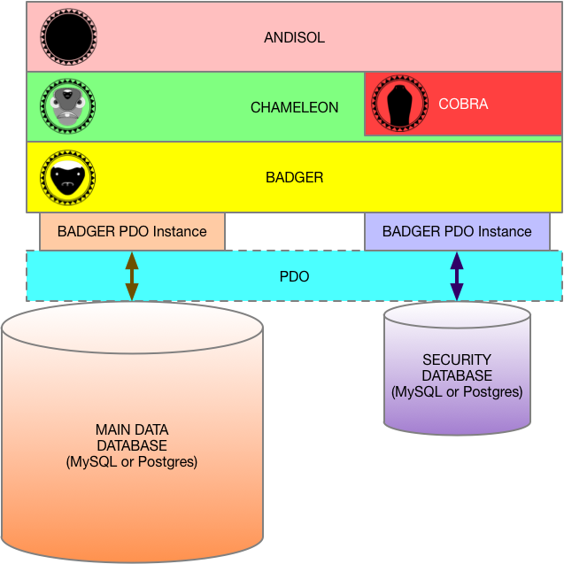

[]: # \mainpage ANDISOL

ANDISOL
=======
Part of the Rift Valley Platform
--------------------------------

INTRODUCTION
============
ANDISOL is the "public face" of the lowest levels of the Rift Valley Platform. It encapsulates the model (database or server connections), and provides an object-based, functional model to the implementation layers.

SUBPROJECTS
===========
ANDISOL is one of four main projects that comprise the foundation of the Rift Valley Platform.

\ref COBRA is the security administration toolbox for the Rift Valley Platform. It is only available to logged-in users that are "manager" users; capable of editing other users.

\ref CHAMELEON is the "First Layer Abstraction" from the data storage and retrieval. It implements a few higher-level capabilities, such as collections, users and places.

\ref BADGER is the "First Layer Connection" to the data storage subsystem. It uses [PHP PDO](http://php.net/manual/en/book.pdo.php) to abstract from the databases, and provide SQL-injection protection through the use of [PHP PDO Prepared Statements](http://php.net/manual/en/pdo.prepared-statements.php).

SECURITY
========

ANDISOL enforces a strict security regimen.

TWO DATABASES
-------------

The first layer of security is that secure login information, and security tokens (more on that later) are all stored in an isolated security database, while the main data items are stored in a data database.

LOGINS
------

There are logins, and one "God" login, that has full rights to anything. The "God" login is defined via the configuration file, as opposed to the database. The login is defined in the security database, but the assigned ID and password are in the config file. This means that even if someone gets into the database, they won't necessarily be able to get "God" permissions.

For "regular" logins, you have two login types:

- "Basic" logins, which can have security tokens assigned.
- "Manager" logins, which can create and edit other logins.

Logins are generally "twinned" with "user" records in the data database. The login, itself, is kept in the security database, but additional user information is kept in the data database. This is not required. Logins (or users) can be standalone.

SECURITY TOKENS
---------------

Security is done via integer "tokens." Tokens are record IDs in the Security database. These can be login IDs, or standalone "security token" IDs. These integers are then referenced as read or write tokens for individual data items.

In order to have read or write access to a given item, a login has to have the token for that record's read and/or write permission.

There are three special tokens:

- -1, which means only the "God" login has access.
- 0, which means that anyone can read (non-logged-in visitors can never modify),
- 1, which means that any logged-in visitor can read (or write, if this is in the write slot).

Integers over 1 are security tokens, and define access on a fairly granular level.

Every record in the Rift Valley Platform dataset has two single tokens: read and write. Each login can have a list of tokens, in addition to the login ID of the login (remember, all security database item IDs double as security tokens). If one of the tokens in a login matches the read or write token of a record, then the user has access to that record; either read or write (which includes read).

If a login does not have an access token for a record, then that record will not be accessible. It will be "invisible" to the user, at a very low level (won't even be accessed at the database level). The security tokens are enforced at the SQL level.

Security tokens are "atomic." They apply ONLY to a given record. They do not propagate to other records. For example, a collection record, which aggregates other records, can have a lower security level than some of the records that it aggregates (or vice-versa).

"Manager" logins have a "pool" of tokens, and can only assign tokens to logins they manage from that "pool."

IMPLEMENTATION
==============

You use ANDISOL by instantiating an instance of the CO_Andisol class, after setting up a valid database configuration.

All interaction with the data layers needs to go through ANDISOL. You can interact with individual data objects, once they have been retrieved by ANDISOL.

LICENSE
=======

© Copyright 2018, [Little Green Viper Software Development LLC](https://littlegreenviper.com).
This code is ENTIRELY proprietary and not to be reused, unless under specific, written license from [Little Green Viper Software Development LLC](https://littlegreenviper.com).
